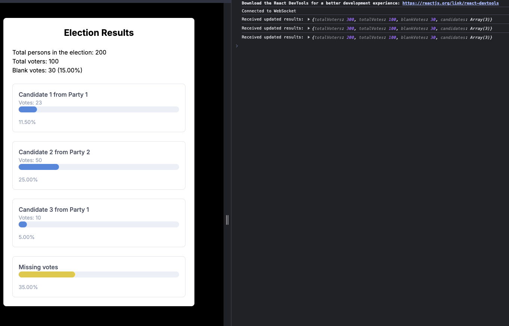

# Readme
## login page

http://localhost:3000/

## Results

http://localhost:3000/results

Show results, expects data from websocket.
for now I'm receving data from a POST method and present this in the ui.

Service: stream-service

http://localhost:8081/send-message

```
{
  "totalVoters": 300,
  "totalVotes": 100,
  "blankVotes": 30,
  "candidates": [
    {
      "candidateId": "3faf55f2-2d6a-4d99-b28c-1b1ac4de4c13",
      "candidateName": "Candidate 1",
      "partyName": "Party 1",
      "votes": 23
    },
    {
      "candidateId": "6db6cbb7-1e4d-4d9c-8f3f-07f3a885cb6b",
      "candidateName": "Candidate 2",
      "partyName": "Party 2",
      "votes": 50
    },
    {
      "candidateId": "2c8a6d5a-b64d-4c9d-8d1c-54a9ff3b019b",
      "candidateName": "Candidate 3",
      "partyName": "Party 1",
      "votes": 10
    }
  ]
}
```


